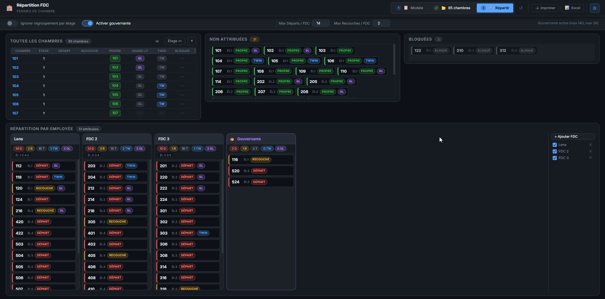

# Répartition FDC — Femmes de Chambre

Outil de répartition quotidienne des chambres pour les femmes de chambre d'un hôtel.
Application web locale, sans installation, sans serveur — fonctionne directement depuis le navigateur (`file://`).



---

## Fonctionnalités

### Gestion des chambres
- Import du tableau de chambres via **fichier Excel** (modèle hôtel)
- Saisie manuelle du statut de chaque chambre : **Départ**, **Recouche**, **Propre**
- Configuration du type de lit : **Twin** / **Grand Lit**
- Chambres **bloquées** (maintenance, hors service)
- Masquage des chambres Propres pour simplifier la vue

### Répartition automatique
Algorithme en plusieurs étapes garantissant un équilibre strict entre toutes les FDC :

| Critère | Contrainte |
|---|---|
| Nombre de Départs | écart max **±1** entre FDC |
| Nombre de Recouches | écart max **±1** entre FDC |
| Nombre de Twin | écart max **±1** entre FDC |
| Nombre de Grand Lit | écart max **±1** entre FDC |
| Total de chambres | écart max **±1** entre FDC |
| Étages | regroupement par étage pour limiter les déplacements |

### Gouvernante
- Activation optionnelle avec limites configurables (max Départs / max Recouches)
- Reçoit le surplus au-delà des limites des FDC
- Incluse dans l'optimisation des étages

### Sidebar FDC
- Liste des femmes de chambre à droite de la répartition
- **Checkbox** pour activer / désactiver une FDC (exclue de la répartition et de l'export)
- Bouton **✕** pour supprimer une FDC
- Renommage en ligne avec mise à jour immédiate

### Export
- **Export Excel** depuis le template hôtel (XLSX) : une feuille par FDC active, en-tête et bordures préservés, X de taille 14 centré dans les colonnes D/R
- **Impression PDF** via la mise en page d'impression navigateur

---

## Structure du projet

```
FDC/
├── index.html          # Interface principale
├── css/
│   └── style.css       # Styles (thème sombre, responsive)
└── js/
    ├── app.js          # État global, gestionnaires d'événements
    ├── algorithm.js    # Algorithme de répartition équitable
    ├── ui.js           # Rendu HTML dynamique
    ├── export.js       # Export Excel (JSZip + OOXML) et impression
    ├── storage.js      # Persistance localStorage
    ├── importer.js     # Lecture du fichier Excel d'import
    └── dragdrop.js     # Glisser-déposer de chambres entre FDC
```

---

## Utilisation

1. Ouvrir `index.html` dans un navigateur (Chrome / Edge recommandé)
2. Charger le **modèle Excel** via le bouton `Modèle` (template hôtel)
3. Importer ou saisir les chambres avec leur statut
4. Ajouter les femmes de chambre via `+ Ajouter FDC`
5. Cliquer sur **Répartir** — la distribution est instantanée
6. Exporter via **Excel** ou **Imprimer**

> L'état est sauvegardé automatiquement dans le `localStorage` du navigateur.

---

## Algorithme de répartition

La distribution se fait en 8 étapes :

1. **Filtrage** — exclut les chambres Propres et bloquées
2. **Calcul des cibles** — D/R/TW/GL par FDC
3. **Phase 1 — Recouches** — équilibre R prioritaire + regroupement par étage
4. **Phase 2 — Départs** — regroupement par étage + équilibre D
5. **Équilibrage D/R** — déplacements pour garantir ±1 sur D et R
5b. **Équilibrage Total** — corrige le cas où D±1 + R±1 → Total±2
6. **Équilibrage TW/GL** — échanges (même status en priorité) pour ±1 sur Twin et GL
6b. **Sécurité D/R** — repasse après bedType pour absorber les effets de bord
7. **Optimisation étages** — échanges même-status+même-bedType pour minimiser les étages distincts
8. **Gouvernante** — incluse dans l'optimisation des étages

---

## Technologies

- **HTML / CSS / JavaScript** pur — zéro dépendance runtime
- [JSZip](https://stuk.github.io/jszip/) — manipulation XLSX côté client
- [SheetJS (XLSX)](https://sheetjs.com/) — import Excel
- Persistance : `localStorage` (clé `fdc_app_state_v1`)
